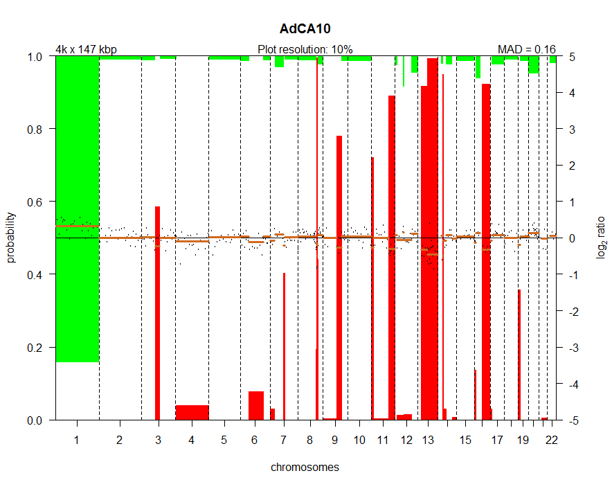
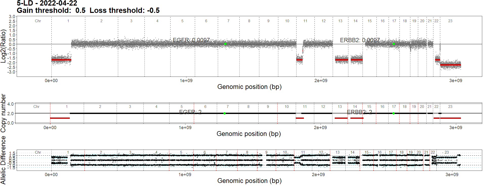

# oncoscanR
- Arm-level Alteration  
    Dans cet ordre: 
    - lit les segments d'altération du fichier segments.txt
    - fusionne les segments de même CN distants de moins de 300Kbp.
    - supprime les segments de moins de 300Kbp 
    - si 80% d'un bras présente la même altération, ce bras est indiqué comme altéré (GAIN/LOSS/AMP/LOH).
- Score LST
    - voir cahier
## input
à partir des .OSCHP, je produis des segments.txt . Je ne recentre pas, ce qui pose des problèmes: pour l'échantillon 8-MM par exemple, 

## détails 
Amp: CNV>2
Gain: CNV>0
Loss: CNV<0

## pipeline
plus d'infos dans le cahier au 27/04


# CGHcall
- fichiers qui parlent de ce package:  
    article: CGHcall_article.pdf  
    description des fonctions du package: CGHcall_functions.pdf  
    reference manual: CGHcall_Reference_Manual__usemewiththescript.pdf  
    R script à utiliser avec le manuel: CGHcall.R  
- les auteurs de la comparaison de 6 outils annoncent avoir créé cghcall*, mais ne le rendent disponible nulle part. Un fichier Tex constitue leur "additional material", par contre. CGHcall est concu pour du aCGH. Il utilise les informations de breakpoint (par l'algo CBS, typiquement), ainsi que "plusieurs concepts biologiques ignorés par les autres algorithmes" et classifie le LRR entre ref et tumeur en 5 états.
- *voir notes_on_articles.md pour les infos sur l'article.*\
L'article ne décrit pas très bien comment le package fonctionne. il parle surtout du mixture model utilisé, il faudrait que je prenne un peu de temps pour comprendre mieux ce qu'est et comment fonctionne un mm. En attendant, je peux avoir une meilleure vue d'ensemble du package en regardant les fonctions utilisées dans le workflow (normalisation...).

-> je lis CGHcall_Reference_Manual__usemewiththescript.pdf en parallèle de CGHcall.R .
Le pipeline est le suivant: 
## Input
un tableau / fichier texte:
- les lignes sont des sondes
- les colonnes sont [voir https://www.rdocumentation.org/packages/CGHbase/versions/1.32.0/topics/make_cghRaw]
passe forcément par la fonction make_cghRaw.

## Output
voir fin du pipeline pour les résultats bruts. 
Différents plots peuvent également être produits:
- Les plots par échantillon présentent des barres vertes et rouges aux endroits où des aberrations sont détectées. Ces dernières correspondent à la probabilité d'avoir un réel gain/perte à cet endroit: si la barre dépasse les 50%, l'altération est considérée réelle.
- Les Frequency plots montrent la fréquence de gains / loss sur tous les échantillons.
- Les Summary plots sont des frequency plots un peu plus sophistiqués: ils pondèrent cette fréquence par la probabilité "a posteriori". Cette dernière est définie par la probabilité remesurée ou recalculée qu'un événement se produise en prenant en compte une nouvelle information. En d'autres termes, c'est la probabilité qu'un événement A ait lieu, sachant qu'un événement B a eu lieu, on peut donc l'écrire P(A|B). Elle s'oppose à la probabilité "a priori" (P(A)) qui est définie par des données ou connaissances antérieures à un calcul ou une observation. voir les pages wikipedia en français pour plus de détails.
En ce qui concerne les objets $cghRaw$, $cghSeg$ et $cghCall$:
Les différences entre Raw et Seg sont minimes. La différence principale est que cghSeg possède un attribut de plus: un tableau contenant les données de Segmentation.
l'objet cghCall est défini dans le cahier au $ 23/03 $.


## Pipeline
``Wilting <- make_cghRaw(Wilting)``
Convertit un dataframe/fichier texte en objet cghRaw.  
Output: objet $cghRaw$  
*montrer un visuel de l'objet*


``cghdata <- preprocess(Wilting, maxmiss=30, nchrom=22)``
Applique différents procédés de préprocess nécessaires pour la suite. maxmiss supprime les lignes ayant des NA dans 30% de leurs échantillons. nchrom indique les chromosomes à garder, les autres sont supprimés.  
Output: objet $cghRaw$  
*oui. illustrer le maxmiss: plot avant/après. pareil pour les chromosomes? à voir.*

``norm.cghdata <- normalize(cghdata, method="median", smoothOutliers=TRUE)``
Normalisation très basique selon la médiane ou le mode; smoothing des outliers par DNAcopy ; possible correction si la proportion de cellules tumorales n'est pas 100% (cela se fait au niveau de la fonction CGHcall()).  
Output: objet $cghRaw$  
*oui. plot avant/après pour la normalisation, et un autre pour mettre en évidence les outliers smoothés->?*

``seg.cghdata <- segmentData(norm.cghdata, method="DNAcopy",undo.splits="sdundo",undo.SD=3, clen=10, relSDlong=5)``  
Apply DNAcopy algorithm that performs segmentation. Cette fonction est un wrapper autour de DNAcopy et permet de défaire les "splits" différemment selon si le segment est long ou court, entre autres. voir cahier pour plus de précisions.  
Output: objet $cghSeg$  
*oui. expliquer le principe décrit dans cahier; plot avant/après*
- Segmentation par DNAcopy

`postseg.cghdata <- postsegnormalize(seg.cghdata)`
faire une normalisation après la segmentation permet de mieux définir le zéro:
```
This function recursively searches for the interval containing the most segmented data, decreasing the interval length in e  recursion. The recursive search makes the post-segmentation normalization robust against local maxima. This function is particularly useful for profiles for which, after segmentation, the 0-level does not coincide with many segments. It is more or less harmless to other profiles. We advise to keep the search interval (inter) small, in particular at the positive (gain) side to avoid that the 0-level is set to a common gain level.
```
Output: objet $cghSeg$  
*oui. --> dans le script, produire le plot illustrant la distribution des segments avant et après la postsegnormalisation pour comparer et montrer l'effet de cette étape.*
- 

``tumor.prop <- c(0.75, 0.9) # one value per sample. proportion of contamination by healthy cells``
``result <- CGHcall(postseg.cghdata,nclass=5,cellularity=tumor.prop)``
L'étape de calling. Le mixture model est créé et utilisé ici. On indique la cellularité dans le vecteur tumor.prop pour qu'elle soit prise en compte (car oui, ça se fait dans cete étape). Le nombre de classes qu'on veut en sortie doit également être précisé.
Output: objet $liste de 7 éléments$ -> voir CGHcall.R, "code chunk number 6"
*plot segments non callés -> segments callés. plot cellularité indiquée/non indiquée?*

`result <- ExpandCGHcall(result,postseg.cghdata)`
Pour convertir le résultat en un objet CGHcall. pour voir l'output, lancer le script CGHcall.R: on récupère des tableaux de la forme suivante:
Output: objet $cghCall$  
*plot segments non callés -> segments callés. plot cellularité indiquée/non indiquée?*
```
            sample1 sample2
probe1      1       1
probe2      1       1
probe3      1       1
probe4      1       2
probe5      1       2
probe6      1       2
```
Ici, la variable est le nombre de copies qui a été called. On a 2 échantillons parce qu'on peut lancer CGHcall sur plusieurs échantillons. On peut récupérer de la même façon le CN brut, ou un tableau de segmentation.

## traitement des résultats & plots

fig.1

## Modèle de mélange
voir cahier 17/03. la vidéo dont je me suis basé explique également comment l'algorithme EM fonctionne.


# EaCoN
Ce package se démarque par sa facilité d'usage (multiples options pour lancer le pipeline, en pas à pas ou en batch) . Il n'apporte pas de technologie innovante mais utilise plusieurs outils (APT, ASCAT) pour faire l'analyse de Nombre de copies de A à Z.
On peut considérer EaCoN comme une interface pour utiliser ASCAT; l'intérêt de cette interface est de produire des métriques, des plots et de faciliter l'utilisation du package par un mode batch.
La spécificité de cet outil est d'estimer la cellularité et la ploidie et de prendre en compte ces paramètres dans le calcul du nombre de copies au niveau allélique. Cela permet de produire des profils ASCAT, définis ainsi:
un profil ASCAT est un profil de nombre de copies au niveau allélique sur le génome entier, et permet de voir, en plus des habituels gains et pertes, les événements neutres de nombre de copies et LOH.

à noter: je parle d'ASCAT mais on peut aussi utiliser FACETS et Sequenza. Cela dit, je n'ai pas réussi à installer FACETS.

## input
Raw cel files
## output
- tables and plots
- portable and interactive HTML report
- Total Copy Number (TCN) and Allele-Specific Copy Number (ASCN)
- estimation of ploidy and cellularity (using ASCAT, ...)

## pipeline
`OS.Process(ATChannelCel = "/home/project/CEL/S1_OncoScan_CNV_A.CEL", GCChannelCel = "/home/project/CEL/S1_OncoScan_CNV_C.CEL", samplename = "S1_OS")`  
Dual-channel Normalization (=Raw data processing). Cette étape est effectuée par *Array Power Tools (APT)*. 
Output: normalized data(filename.RDS), plots, metrics.
$slide: montrer plots et métriques$

`Segment.ff(RDS.file = "/home/me/my_project/EaCoN_results/SAMPLE1/S1_OncoScan_CNV_hg19_processed.RDS", segmenter = "ASCAT")`  
L2R & BAF Segmentation. Cette fonction effectue:
- la segmentation (L2R and BAF bivariate segmentation). Utilise *ASCAT*
- la centralisation
- le calling (par l'algo ASPCF, $voir fig S2 supplementary $)
output: segmented data(filename.RDS), résultats de segmentation L2R *fichiers .CBS*, plots de segmentation par BAF et par L2R, métriques... voir github pour plus de détail.
$slide: montrer plots et métriques. expliquer comment la segmentation se fait? $

`ASCN.ff(RDS.file = "/home/me/my_project/EaCoN_results/SAMPLE1/ASCAT/L2R/SAMPLE1.ASCAT.RDS")`
Estimation du copy number -> $expliquer l'estimation des 2 paramètres avec la fig 1$
output:  $voir fig 1 article$
- fichier .RDS: données de segmentation ASCN et TCN,
- fichier .txt: ploidie moyenne, cellularité et statistiques du modèle.
$slide: montrer plots et métriques. expliquer comment la ploidie et de la cellularité sont déterminées, et une fois qu'elles le sont, on estime le nombre de copies réel de chaque segment. $


`Annotate.ff(RDS.file = "/home/project/EaCoN_results/S1/ASCAT/L2R/S1.EaCoN.ASPCF.RDS", author.name = "Me!")`
HTML reporting  
$tester l'export de l'HTML en pdf/excel/txt: différences...-> c'est pour chaque section, en fait.$

## ASCAT en détail ##
Deux paramètres sont calculés par ASCAT à partir de données SNP: L'estimation de la cellularité et l'estimation de la ploidie. A partir de ces deux paramètres, le copy number est estimé. L'algorithme TuScan fait ça aussi, selon l'aide de Chas, page 509.
De plus, on peut savoir quel allèle a été gagné/perdu par rapport à l'autre (allelic skewness = asymétrie allélique). L'asymétrie allélique peut être déterminée à partir de données Oncoscan.

les fonctions d'ASCAT:
- ascat.asmultipcf                Allele-specific segmentation of multiple samples
This segmentation function should only be used if part of the breakpoints are expected to be shared between samples, e.g. due to a common ancestry.
- ascat.aspcf                     ascat.aspcf
run ASPCF segmentation
input: $ASCATobj$: an ASCAT object
- ascat.correctLogR               ascat.correctLogR
Corrects logR of the tumour sample(s) with genomic GC content (replication timing is optional)
- ascat.GCcorrect                 ascat.GCcorrect
Function kept for backward compatibility, please use ascat.correctLogR instead
- ascat.getAlleleCounts           Obtain allele counts for a given set of loci through external program alleleCounter.
Obtain allele counts for a given set of loci through external program alleleCounter.
input: $BAM/CRAM$
- ascat.getBAFsAndLogRs           Obtain BAF and LogR from the allele counts.
Obtain BAF and LogR from the allele counts.
input: $file tumor & file ref$
- ascat.loadData                  ascat.loadData
``first function``
Function to read in SNP array data.
input: $file tumor & file ref$
- ascat.metrics                   Function to extract different metrics from ASCAT profiles.
    Value
    A dataframe (one sample per line) with the following metrics (as columns):
    1. sex - Sex information as provided.
    2. tumour_mapd - Median Absolute Pairwise Difference (MAPD) in tumour logR track.
    3. normal_mapd - Median Absolute Pairwise Difference (MAPD) in normal logR track (should be NA without matched normals and 0 for sequencing data).
    4. GC_correction_before - logR/GC correlation before correction.
    5. GC_correction_after - logR/GC correlation after correction.
    6. RT_correction_before - logR/RT correlation before correction.
    7. RT_correction_after - logR/RT correlation after correction.
    8. n_het_SNP - Number of heterozygous SNPs.
    9. n_segs_logR - Number of segments in the logR track.
    10. n_segs_BAF - Number of segments in the BAF track.
    11. n_segs_logRBAF_diff - Difference between number of segments in the logR versus BAF track.
    12. frac_homo - Fraction of homozygous (<0.1 | >0.9) probes in tumour.
    13. purity - Purity estimate.
    14. ploidy - Ploidy estimate.
    15. goodness_of_fit - Goodness of fit.
    16. n_segs - Number of copy-number segments.
    17. segs_size - Total size of all segments.
    18. n_segs_1kSNP - Number of segments per 1k heterozygous SNPs.
    19. homdel_segs - Number of segments with homozygous deletion.
    20. homdel_largest - largest segment with homozygous deletion.
    21. homdel_size - Total size of segments with homozygous deletion.
    22. homdel_fraction - Fraction of the genome with homozygous deletion.
    23. LOH - Fraction of the genome with LOH (ignoring sex chromosomes).
    24. mode_minA - Mode of the minor allele (ignoring sex chromosomes).
    25. mode_majA - Mode of the major allele (ignoring sex chromosomes).
    26. WGD - Whole genome doubling event (ignoring sex chromosomes).
    27. GI - Genomic instability score (ignoring sex chromosomes)
Le GI, ici, mesure la proportion de sondes dont la valeur de call est différente de la ligne de base. cette dernière est déterminée à partir du WGD. Seules les sondes appartenant à des segments sont utilisées. cf page 1 du cahier.

## main ASCAT fx
- ascat.runAscat                  ascat.runAscat
ASCAT main function, calculating the allele-specific copy numbers
input: 
$ASCATobj$	
an ASCAT object from ascat.aspcf
- ascat.synchroniseFiles          Synchronise SNPs across files


## ASPCF en détail
ASPCF effectue le calling, dans l'étape de segmentation.  

## comment EaCoN envoie-t-il les données des fichiers CEL d'oncoscan CNV à ASCAT?
La fonction `OS.Process` est utilisée pour cela. Elle comporte les étapes suivantes:
```
CEL.OS <- custom_compressed_handler(c(ATChannelCel, GCChannelCel))
ATChannelCel <- CEL.OS[1]
GCChannelCel <- CEL.OS[2]

oscf <- apt.oncoscan.process(ATChannelCel = ATChannelCel, 
                            GCChannelCel = GCChannelCel, samplename = samplename, 
                            dual.norm = dual.norm, out.dir = out.dir, temp.files.keep = FALSE, 
                            force.OS = force.OS, apt.build = apt.build)
my.oschp <- oschp.load(file = oscf)
```
la normalisation des données passe par ``apt-copynumber-onco-ssa``. or le package R qui permet cela est en 16-bits sous windows, la commande plante à ce moment-là. je regarde comment la fonction de ce package appelle la commande apt; on peut l'utiliser nous-mêmes. on peut aussi utiliser le package R sous linux. ou ne pas utiliser cette normalisation pour l'instant.

## résultats de nos échantillons traités par ASCAT:
sample  | Goodness of fit   | Gamma | rho (purity)  | psi (ploidy)
--      |-                  |-      |-              |-
7-DG    |98.76              |0.95   |1              |2.21
6-VJ    |97.77              |0.55   |0.8            |1.74
5-LD    |99.26              |0.45   |0.83           |1.75

(Seuls les résultats de la meilleure goodness of fit sont montrés)


# DNAcopy
voir cahier au 25/03: et au 11/03: undoing splits
1. crée une distribution de référence à l'aide d'un test de permutation.
2. parcourt le génome et sépare récursivement chaque chromosome en 2 ou 3 sous-segments selon une statistique T et la distribution de référence.
3. défait certaines séparations selon les règles suivantes:
Si un segment court est suffisamment proche d'un autre segment, alors ils sont fusionnés.
De même, si deux segments longs sont suffisamment proches, ils sont fusionnés.

clen est la longueur qui définit un segment court.
undo.SD est la distance, en nombre d'écart-types, qui définit "suffisamment proche" pour le premier cas: si undo.SD=3, la fusion est effectuée quand les segments sont séparés de trois écart-types.
pour deux segments longs, cette distance correspond à undo.SD/relSDlong .
## output (segmentation):
voir la doc de la fonction `segment()` de DNAcopy en ligne: https://rdrr.io/bioc/DNAcopy/man/segment.html ou sur R.
```
       ID chrom loc.start loc.end num.mark seg.mean
1  c05296     1       468  240000      132   0.0212
2  c05296     2         0  245000       64   0.0095
3  c05296     3         0  218000       86   0.0025
4  c05296     4         0  184000      165  -0.0007
5  c05296     5         0  198500      108  -0.0107
6  c05296     6         0  188000       85  -0.0048
7  c05296     7         0  161500      172  -0.0042
8  c05296     8         0  147000      151  -0.0026
9  c05296     9         0  115000      111  -0.0236
10 c05296    10         0   64187       53  -0.0165
11 c05296    10     65000  110000       41   0.5002
12 c05296    10    110412  142000       32  -0.0076
13 c05296    11         0   34420       51   0.0121
14 c05296    11     35416   39623       15  -0.6511
15 c05296    11     43357  145000      119   0.0171
16 c05296    12         0  142000       94   0.0204
17 c05296    13      3426  100500       57  -0.0337
18 c05296    14       770   97000       76   0.0191
19 c05296    15         0   79000       66   0.0138
20 c05296    16         0   84000       66   0.0270
21 c05296    17         0   86000       91   0.0538
22 c05296    18         0   86000       53   0.0018
23 c05296    19         0   70000       37  -0.0274
24 c05296    20         0   73000       87   0.0129
25 c05296    21      3131   30000       33   0.0311
26 c05296    22      1100   33000       16   0.0183
27 c05296    23         0  155000       51   0.7184
```
Un segment = une ligne. Il s'agit ici de donneés test. à part les chromosomes 10 et 11, un seul segment par chromosome a été trouvé. ID = sample Id; num.mark = nombre de marqueurs dans le segment.


# rCGH
le mode d'emploi de rCGH est rCGH_manual.pdf dans docs. il va de pair avec rCGH.R dans scripts.
rCGH manual (the pdf):
la CGH sur array est largement utilisée en médecine, notamment pour détecter les altérations moléculaires précises. RCGH est un workflow d'analyses des données générées par cette technologie.

## pipeline
un workflow typique est présenté dans le document. il produit un objet rCGH.
`cgh = rCGH::readAffyOncoScan(customFilePath)`
Charge les données du fichier probeset.txt
On peut spécifier quel génome de référence utiliser parmi hg18, 19 et 38.
On peut spécifier la ploidie a priori pour ajuster l'estimation du nombre de copies.
*slide éventuellement sur ce que la ploidie change*

`cghAdj <- adjustSignal(cgh, nCores=1, suppOutliers=TRUE)`
Normalise les log Ratios.
Si spécifié, lisse les outliers en utilisant EM:
```
When suppOutliers is TRUE (default), the Log2Ratios are splitted with respect to chromosomes. The main regions within each chromosome are identified using EM. Within each region r_i, x[r_i] values are redifined according to the corresponding model parameters. as:
x[r_i] ~ N(mu_i, sigma_i)
```
génère des scores de qualité:
- derivative Log Ratio Spread (dLRs) -> estime le bruit. cf cahier 21/04/2022: c'est la moyenne de la dérivée des différences de log ratio entre 2 sondes consécutives. Très bon si <0.20 .
- Median Absolute Deviation (MAD) -> estime la variabilité. cf cahier 21/04/2022: c'est la médiane des écarts à la moyenne.
*slide: plot before/after adjusting*


`cghSeg <- segmentCGH(cghAdj, nCores=1)`
pour segmenter, on utilise l'algo CBS de DNAcopy. les arguments de DNAcopy (undo.SD, ...) peuvent être donnés ici.
Le résultat contient la moyenne, la médiane et le nombre de sondes du segment ainsi que l'écart type de ses valeurs de log ratio, et une estimation du nombre de copies.
On peut obtenir les sous forme de tableau par sonde, ou par segment. 
    `geneTable <- byGeneTable(segTable)`
    Cette  commande permet d'avoir un tableau par gène, où il se positionne sur le génome, sa valeur de log Ratio...
    *slides: tableau par gène, montrer l'input et l'output, parler du fait que n'importe quelle segmentation table peut être donnée, donc c'est intéressant à utiliser même dans d'autre packages.*
*slides: tableau de segmentation par sonde et par segment, parler des infos additionnelles sur chaque seg: moyenne, nb markers...*
*slides: avant/après segmentation (par rapport au log ratio -> dessiner les segments par-dessus! et faire les points très petits, mais tous les garder.)*
                       

`cghNorm <- EMnormalize(cghSeg)`
la fonction EMnormalize() est utilisée pour centraliser les LRR et plotDensity() permet de visualiser cette étape et de voir quel groupe de segments a servi à centraliser les données.
*slides: log Ratio avant/après*
*slides: explpiquer le plotDensity avec la fig 1 suppl. cf cahier*
*slides: plotDensity avec le log ratio: réduire et pivoter le plotDensity et le mettre à gauche du graphe de log ratio pour faire correspondre les pics aux valeurs.*

### data visualisation: 
`multiplot(cghNorm, symbol = c("egfr", "erbb2"))`


## input
2 choix: 
<!-- - La fonction readAffySNP6() permet de lire des fichiers probeset.txt, ce qui nous convient. Pas forcément besoin de passer par un custom array.

- La fonction ReadGeneric() permet de lire un custom array. il doit comporter les colonnes suivantes:  
    `ProbeName(probe id)     ChrNum     ChrStart(The chromosomal probe locations)       Log2Ratio (amplification/deletion)`  
    voir tableau 3 de l'excel comparatif.
    Cela crée un objet _rCGH-generic_. il contient:
    - les infos de l'echantillon
    - le dataset par sonde 
    - les paramètres du workflow
    - les données de segmentation -->
On utilise readOncoscan(). D'ailleurs, la colonne "ChrStart" qu'attend rCGH et la colonne "position"  de notre probeset.txt contiennent les mêmes valeurs.

## output

1. Segmentation table:
```
           ID chrom loc.start   loc.end num.mark seg.mean seg.med probes.Sd estimCopy
1 CSc.Example     1    882803 249116709     1209   0.0087 -0.0504 0.9799602         2
2 CSc.Example     2     15703 242497851     1317   0.8874  0.8791 0.9901649         4
3 CSc.Example     3     62614 197683938     1100   0.8791  0.8791 0.9786349         4
4 CSc.Example     4     46691 190921709     1042  -0.0075 -0.0504 0.9883702         2
5 CSc.Example     5    113577 180579439      986   0.8502  0.8791 0.9907562         4
6 CSc.Example     6    184719 170849100     1103  -0.0105 -0.0504 1.0052332         2
```

2. byGeneTable:
```
  entrezid   symbol                       fullName cytoband chr chrStart   chrEnd width strand Log2Ratio num.mark segNum segLength(kb) estimCopy relativeLog genomeStart
1        1     A1BG         alpha-1-B_glycoprotein_19q13.43  19 58858172 58874214 16043      -   0.80185      231     21      58810.89         4           0  2718302494
2   503538 A1BG-AS1           A1BG antisense_RNA_1_19q13.43  19 58859117 58866549  7433      +   0.80185      231     21      58810.89         4           0  2718303439
3    29974     A1CF  APOBEC1_complementation_facto_10q11.23  10 52559169 52645435 86267      -   0.94135      751     10     135239.66         4           0  1732932312
```
- on a la liste des gènes (hg19) et leur position au sein de chaque segment. on peut donc automatiser la suppression de segments sans gènes pour un nettoyage.

## visualisation interactive des données
Disponible en ligne : ` https://fredcommo.shinyapps.io/aCGH_viewer/ `et dans R.

## notes
- ce package permet la parallélisation des tâches de normalisation & de segmentation de par l'utilisation du package parallel.
- pour rappel:
    un ratio est de la forme test/control, où control est la valeur de référence. si la valeur test est supérieure au control, le ratio va de 1 à +inf. mais si test est inférieur à control, le ratio va de 0 à 1. appliquer le log2 de ce ratio permet de rendre symétrique la répartition autour de 1. (autour de zéro?)
- additionnally, this package offers different genomic profile visualisation functions, static and interactive.
