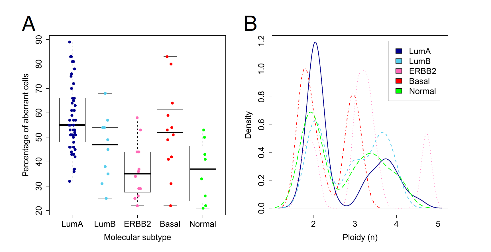

# <span style="color:#ff9999">Automated Detection of Arm-Level Alterations for Individual Cancer Patients in the Clinical Setting
2021_Christinat_HRD_Oncoscan.pdf

Copy number alterations, a genetic event, promotes tumor development. these events are used as predictive biomarkers in clinical care. they are roughly classified as arm-level or focal. genome-wide techniques exist to classify arm-level ones, but challenges exist:
- How to define an arm-level alteration? there is no consensus on it.
- there is a lack of tools to compute them for individual patients.
To answer this, using OncoScan, clinical samples were analyzed. The results indicate respectively that:
- sum of altered segments was a better indicator than longest segment to define an arm-level alteration, BUT Some of the discordances ultimately were attributed to human error.
- a new software has been made publicly available in routine analyses (https://doi.org/10.1016/j.jmoldx.2021.08.003)

Les altérations arm-level sont plus longues que les focales: elles contiennent des centaines de gènes. Leur effet sur les phénotypes de cancer est connu, mais il est compliqué, quand ce n'est pas impossible, de lier cet effet à des gènes individuels.
Cependant, les avancées technologiques récentes en génomique offrent des indications sur la valeur prédictive des arm-level alterations: on associe par exemple la perte de tels bras de tels chromosomes à un critère principal de diagnostic pour les oligodendrogliomes. Il y a plusieurs autres exemples de ça, également pour le pronostic. D'autre part,  l'aneuploidie (le fait pour une cellule d'avoir un nombre anormal de chromosomes, donc de ne pas être euploide) a un intérêt dans le pronostic mais n'est pas toujours utilisé dans la prise de décision thérapeutique.
Certaines méthodes utilisent du FFPE mais ces manips sont sujettes à dégrader l'ADN. la technique Oncoscan est conçue et optimisée pour le FFPE. D'autre part, GISTIC est une méthode largement utilisée pour estimer les Copy Number Alterations (CNA).
Enfin, la définition d'arm-level varie dans les exemples présents dans la littérature. Le seuil d'altération d'un bras chromosomique à partir duquel on ne considère plus l'altération comme focale mais comme arm-level varie au cas par cas.
Cette étude vise à définir précisément les arm-level alterations qui peuvent être appliquées dans un contexte clinique.

En utilisant la technique Oncoscan sur des échantillons FFPE, des .CEL ont été produits, puis convertis en .OSCHP (OncoScan array data) qui ont été analysés à l'aide du logiciel Chromosome Analysis Suite (ChAS) avec le génome de référence: hg19. Les résultats ont été évalués manuellement. Précision: les segments de moins de 50 marqueurs ou moins de 50 Kbp ont été ignorés.


## Estimation of Percentage Arm Alteration
les données de nombre de copies ont été utilisées pour  détecter des arm-level alterations (ALA), puis ont été processées par un script R


# <span style="color:#ff9999">Uterine smooth muscle tumor analysis by comparative genomic hybridization: a useful diagnostic tool in challenging lesions
modpathol20153.pdf

the diagnosis of STUMP tumors is often challenging. The authors proposed to test the hypothesis that GI could split those tumors in two groups: benign and malignant. A study was conducted, using a threshold of 10 to classify the STUMP.
In conclusion, genomic index is a useful technique to classify these tumors. more specifically, genomic index divides
problematic uterine smooth muscle lesions into leiomyomas and leiomyosarcomas.


# <span style="color:#ff9999">The Nanocind Signature Is an Independent Prognosticator of Recurrence and Death in Uterine Leiomyosarcomas

Nanocind_signature_S._CROCE.pdf

Uterine leiomyosarcoma is an aggressive tumor responsible for a significant proportion of uterine cancer–related deaths. Plus, using the FIGO staging system, it is currently impossible to predict the clinical outcome of stage I leiomyosarcomas. However, the authors published in 2010 a transcriptomic signature (67 genes related to chromosome biogenesis, mitosis control, and chromosome segregation), which has proven since its predicting efficiency over different cancer types. Plus, it has been successfully used with NanoCind (Nanostring) technology, which makes it usable routinely.
Uterine leiomyosarcoma were analyzed with the Nanocind signature. The process split the group in two groups. This result was validated.
In conclusion, the NanoCind signature is a powerful prognostic indicator that outperforms FIGO staging and the genomic index. Plus, GI is platform-dependent. 

Il est plusieurs fois fait mention de l'article [17] de la biblio en parlant du GI. lire cet article.

# <span style="color:#ff9999"> A faster circular binary segmentation algorithm for the analysis of array CGH data
segmentation_algo_for_CGH_data.pdf

la technologie array-CGH recense le nombre de copies de milliers de sites d'un génome. l'algorithme CBS développé dans cet article permet de segmenter le génome en régions de même nombre de copies. Il peut être utilisé dans R à l'aide du package DNAcopy.

# <span style="color:#ff9999"> Copy number aberrations from Affymetrix SNP 6.0 genotyping data—how accurate are commonly used prediction approaches ?

Copy_number_aberrations_from_Affymetrix_SNP.pdf

Les aberrations du nombre de copies (CNA) jouent un rôle important dans la recherche sur le cancer. Un défi dans la quantification des CNA est l'effet de variables confondantes. pour traiter de ce problème, Les auteurs ont comparé les différents algorithmes d'identification de CNA sur les données d'Affymetrix SNP 6.0 genotyping.

-> OncoSNP semble être un algorithme pour traiter ces données.
Conclusion:


# <span style="color:#ff9999"> A statistical approach for detecting genomic aberrations in heterogeneous tumor samples from single nucleotide polymorphism genotyping data

oncoSNP.pdf

-> je pensais qu'oncoSNP était dédié spécifiquement à oncoscan / Affymetrix SNP, mais il n'en est rien :/


# <span style="color:#ff9999"> CGHcall: calling aberrations for array CGH tumor profiles

CGHcall_article.pdf

## Intro
 définition de l'array-CGH; définition du calling (transformer les logs ratio en copy number, donc caractériser en gain/loss/amp(/loh)); les algos de segmentation classiques détectent les breakpoints et les levels mais ne font pas directement de calling: c'est problématique quand on a beaucoup de bp et de levels différents. 
 De nouveaux algos sont basés sur des mesures de confidence (P-val, False Discovery Rate). Comme ils sont basés sur des statistiques, le niveau de CN "normal" a un statut différent des loss et gain, ce qui limite le nombre d'aberrations lors du calling.  Cependant, de l'expérience des auteurs, les biologistes préfèrent les approches plus "state-neutral" pour obtenir la meilleure classification entre 3 ou 4 états. _Utiliser un mixture model permet cela_ !
 CGHcall combine les points forts des méthodes développées dans le passé:
 1. la segmentation de DNAcopy (CBS, donc) est utilisée. C'est l'un des meilleurs algos dans son domaine.
 2. les loss, gain et normal states ne peuvent être anticipés donc CGHcall utilise des effets aléatoires (VOIR L'ARTICLE CGHcall_random_effects.pdf)
 3. les résultats de segmentation sont combinés avec un Mixture model (VOIR CGHcall_mixturemodel_picard.pdf) afin d'obtenir la classification par segment la plus réaliste possible (plutôt que par individu(?)).
De plus:
- six états (double deletion, single deletion, normal, gain, double gain and amplification) au lieu des trois conventionels (loss, normal, gain (and amp)) sont utilisés; ce qui a une plus grande correspondance avec la réalité biologique.
- Ils utilisent un mixture model combiné aux résultats de segmentation basé sur le travail de  `CGHcall_mixturemodel_picard.pdf`

## Methods
Je ne comprends pas le lien entre ces phrases:
```
Pb récurrent des données array-CGH: Les sondes d'un chromosome sont souvent très corrélées avec leurs voisines.
CGHcall reconnait que les algos de segmentation sont efficaces pour cette tâche (trouver des breakpoints). 
Les clones d'un même segment appartiennent tous forcément au même état.
```
Passons, voici la suite:
Ils ont fitté un modèle (de mixture, donc) en utilisant les données LR normalisées. une courbe de gausse représente les données de chaque segment. Les sondes sont classées dans 

## Results
- "CGHcall outperformed the other methods for this setting (SEE SUPPLEMENTARY INFORMATION)." `<---voir ce que ça veut dire`
- "Nous illustrons l'utilisation de notre modèle à 6 états à la place du modèle plus courant à 3 états." -> ils ont fait tourner les 2 modèles sur les mêmes données, et le modèle 6-states trouve des résultats corroborés par le travail visuel d'un expert et par une analyse FISH, résultats qui ne sont pas trouvés par le modèle à 3 copies. 
- ils travaillent sur un mixture model dit (1), et un mixture model dit alternatif. 
    - les mixture proportions de mm1 sont estimées à partir de toutes les données, ce qui peut entraîner un problème. Lequel? comme des chromosomes(ou bras) peuvent être non altérés de manière récurrente, ils tirent vers le bas la probabilité (calculée sur tous les chromosomes) d'un chromosome altéré d'être caractérisé comme tel. Pour résoudre cela, le modèle alternatif est construit en considérant le bras chromosomique comme niveau de résolution. Pourquoi? Parce que :
        1. "Cela limite le nombre de paramètres à estimer"
        2. On ne peut pas considérer les segments comme une entité commune, car leur longueur diffère entre plusieurs échantillons.
        3. Beaucoup d'événements d'aberration surviennent au niveau des bras.
    - mm1 fait du calling par segment, et mmalt fait du calling par bras. Au niveau du modèle de mixture, ça veut dire qu'il cherche à classifier les données en bras plutôt qu'en segments.

## discussion
- Le modèle de mélange hiérarchique permet la variabilité au sein des niveaux de gain ou de perte, ce qui permet de tenir compte des effets (inconnus) qui font que les aberrations se traduisent par des niveaux de log-ratio non constants.
- CGHcall a une option permettant de corriger les données brutes pour différentes contaminations par des cellules saines


Supplementary information: `CGHcallSupplement_vdWiel.pdf`
"Summary Plot is a function which produced overview helps to determine the aberrated chromosomal regions that are recurrent."

Supplementary information's article 7: ``CGHcall__rare_ampliconsxxx.pdf`` 


# <span style="color:#ff9999"> A Segmentation-Clustering problem for the ana<span style="color:#ff9900">l<span style="color:#ff9999">ysis of array CGH data
CGHcall_mixturemodel_picard.pdf      

## Intro
Les techniques d' array-CGH produisent des résultats pouvant être représentés par une succession de segments. Les techniques de segmentation sont tout naturellement utilisées pour les traiter, mais elles ne permettent pas de donner un statut biologique aux segments détectés.  
Les auteurs proposent un nouveau model pour répondre à ça, qui combine un modèle de seg avec un mixture model. Ils présentent (aussi!) un algorithme hybride qui permet d'estimer les paramètres par maximum likelihood. Cet algo est basé sur le dynamic programming (voir wkp) et l'algorithme expectation–maximization.

## Discussion
Cette partie n'est pas claire. voir plutôt les méthodes pour comprendre pk ils utilisent un mm pour faire de la segmentation.


# <span style="color:#ff9999"> DNAcopy: A Package for Analyzing DNA Copy Data
DNAcopy_documentation.pdf

Cet outil sert à identifier les régions où un gain / une perte de nombre de copies survient, et met à disposition une fonction pour faire différents plots.

smoothing outliers: si une donnée individuelle est trop éloignée des autres, l'aplatir pour qu'elle rejoigne les autres sondes proches d'elle.
puis, segmenter et plotter.


j'ai créé une image quelques jours plus tot, je la [cite](#plot_image) pour tester la référence dans markdown.

# <span style="color:#ff9999"> Allele-specific copy number analysis of tumors (ASCAT)
ASCAT_article.pdf  
## abstract
Allele-specific Copy number pour tumeurs solides.; estimation de la ploidie et de la cellularité. L'agrégation des profils ASCAT obtenus rend compte de la distribution des fréquences génomiques de gains et pertes, et permet de visualiser sur le génome entier les événements de nombre de copies neutre et de LOH.  
Les profils ASCAT permettent également de construire une carte d'asymétrie allélique (genome-wide map of allelic skewness), qui indique les loci où un allèle est perdu plus que l'autre.

## Intro
Les altérations génomiques sont facteurs clés de nombreux cancers. Les génomes tumoraux sont largement traités par CGH pour caractériser ces altérations, mais l'interprétation de telles données peut être difficile, majoritairement pour deux raisons:
- beaucoup de tumeurs dérivent d'un état diploide
- beaucoup de données contiennent des cellules de populations tumorales différentes et de cellules saines.
Ainsi, bien des travaux ont été limités à l'étude des gains et pertes et ne peuvent pas attribuer un nombre de copies correct à chaque locus du génome de référence.
Les auteurs présentent ainsi une analyse au niveau allélique du nombre de copies, qui prend en compte l'aneuploidie ainsi que l'infiltration de cellules saines.
Des profils ASCAT (allele specific CN analysis of Tumor) sur le génome entier sont ainsi obtenus. L'analyse de ces profils a révélé des différences (de gain, loss, LOH...)entre les sous-types de cancer du sein que les auteurs ont identifié.

## Discussion
La CGH est un standard pour traiter les aberrations chromosomales dans les tumeurs. Cependant, il reste difficile de déterminer des profils précis de nombre de copies.  
Certains facteurs compliquent également les choses: __les cellules tumorales sont souvent aneuploides (=nombre de copies altéré), et les échantillons contiennent souvent plusieurs populations de tumeurs + des cellules saines__ [^1]. De plus, la CGH n'indique pas quel allèle a été perdu/gagné, et elle ignore les aberrations de nombre de copies neutre. Soit dit en passant, les événements de nombre de copies neutre (copy number-neutral event (CNNE)) sont définis par un changement allélique (pour un SNP nativement hétérozygote) pour lequel le nombre de copies total ne diffère pas de la ploidie tumorale. Par exemple, imaginons une tumeur globalement quadriploide. à une position donnée, on a donc 2 copies de chaque allèle. un allèle perd une de ses copies tandis que le deuxième en gagne une de plus. on est alors à 1 et 3 copies pour les 2 allèles. Au total, on est bien en 4n, donc CN-neutral.
Bref, les technologies SNP promettent de résoudre ce problème. Cependant, pour que l'ASCN soit calculé à partir de données SNP, ces deux effets doivent être modélisés simultanément.
Les auteurs ont développé ASCAT, un outil pour inférer des profils ASCAT **à partir de données SNP** (L'estimation de la cellularité et l'estimation de quel allèle a été gagné/perdu par rapport à l'autre pourront-ils quand même être faits à partir de données Oncoscan?).

La distribution de la ploidie et de la proportion de cellules montre que la variabilité de ces paramètres peut être grande (voir figure 1) . Cela indique que les analyses qui ne les prennent pas en compte interprètent incorrectement 50% des cas.
Les profils ASCAT permettent de visualiser les événements LOH et copy number-neutral, événements non perceptibles par l'aCGH. Les auteurs ont observé que la distribution de LOH correspondait fortement avec la distribution des pertes, ce qui s'explique par le fait que de nombreuses pertes résultent également en LOH. D'autre part, des correspondances entre les pertes et les copy number-neutral events (CNNE) ont été observées. Cela indique que les fréquences de perte par allèle sont plus grandes qu'on ne l'imagine en travaillant avec des outils ne prenant pas en compte les CNNE. 
Voici pourquoi:
- ASCAT observe que loss & CNNE sont corrélés
- Or ASCAT prend en compte les CNNE.
- si il ne les prenait pas en compte, le nombre de CNNE trouvés passerait à 0. La corrélation indique que dès lors, le nombre de loss diminuerait.
- les outils ne prenant pas en compte les CNNE sont dans ce cas. On peut donc dire que ces outils sous-estiment largement le nombre réel de loss.
La correction pour la cellularité révèle que les tumeurs qui en ont le plus eu besoin ne présentent pas moins d'aberrations que les autres, seulement que ces aberrations étaient manquées par les approches qui ne tiennent pas compte de ce paramètre.


[^1]: déjà dit dans l'intro
## Figures  


