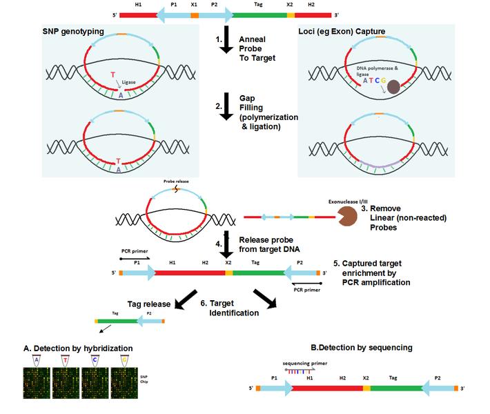

# 14/02/2022
tomorrow: meeting on the planning of the internship

I received pdfs from claire:
- Projet_GIRONDE_synopsis23052019.pdf
- 2021_Christinat_HRD_Oncoscan.pdf
- modpathol20153.pdf
- Nanocind_signature_S._CROCE.pdf

See notes_on_articles.md .\
About the synopsis:
## Projet_GIRONDE_synopsis23052019.pdf
le pronostic des lésions musculaires tumorales peut passer par des techniques comme l'index génomique (GI) = degré de complexité moléculaire & d'instabilité génomique. bon prédicteur de l'agressivité d'une tumeur.
cela est fait à partir de la technologie Agilent, mais l'équipe veut étendre ça à la technologie Oncoscan, plus récente. pour cela, il est important de comparer ces deux technologies sur cette même technique.
Cela est pertinent :
- en terme de diagnostique, car certaines tumeurs ne peuvent pas être traitées par les méthodes morphologiques.
- en terme de pronostique et de thérapeutique, cette méthode pourrait être appliquée à différentes tumeurs, même si on travaillera dans un premier temps sur les tumeurs stromales gastro-intestinales (GIST).

obj: transposer le calcul du GI et détermination du seuil de classification des tumeurs from Agilent to Affymetrix.
Oncoscan a une résolution et une couverture génomique plus large. cela devrait permettre une plus grande précision dans le diagnostique.

## Suivre la manip cette semaine
TODO: Remise en contexte: qu'est-ce que cette manip cherche à faire?
-> produire un index génomique
    -> comment est calculé l'index génomique?
    GI = A^2/C
    où A = total number of alterations (segmental gains and losses)
    et C = the number of involved chromosomes.
    -> C est déterminé par l'expérience
    -> A : ?

15:50
J'ai suivi la manip avec Laetitia. Il semble qu'on fasse du SNP genotyping, et pas du Loci Capture.
Cette image illustre la manipulation dans son ensemble:

D'où viennent les échantillons liquides d'ADN?
Laetitia reçoit des lames colorées Hématoxyline Éosine Safran (HES) + un FFPE: bloc de cellules tumorales extrait chirurgicalement. à l'aide de la lame (issue du bloc), elle sait où récupérer les cellules les plus tumorales du bloc. l'ADN est ensuite extrait de ces cellules sous forme liquide.
cet ADN est appelé l'ADNg dans le protocole. Après avoir ajouté des sondes MIP, on le chauffe à 95°C pour passer de double à simple brin, puis on descend à 58°C pendant 2h pour laisser les sondes MIP s'associer aux brins d'ADN. Cette association est appelée Annealing. La structure en anneau ainsi formée est centrée sur un nucléotide du brin d'ADN, le seul qui n'est pas couvert par la sonde.
l'étape suivante est le gap filling. on sépare le résultat de l'annealing en 2: un tube recevra du AT, l'autre du CG. les gaps seront complétés de manière complémentaire. ultimement, cela nous apprendra... qu'est-ce que ça nous apprend?
Bref, une exonucléase est ensuite ajoutée pour dégrader les brins d'ADN libres (cela inclut les sondes non accrochées) et ne garder ainsi que les anneaux. ces derniers sont ensuite clivés, ce qui donne la structure suivante:

%%%%###########@@@@@@@@@@@@@@@@@@@@@@@@@@@@@@

Où:\
%%%%% = Site 1 de clivage\
\##### = tag correspondant à la séquence d'ADN\
@@@@@ = région homologue à la séquence d'ADN visée.

Deux PCR sont ensuite effectuées pour multiplier les sondes, puis une digestion Hae III est appliquée pour cliver la séquence ADN du reste de la sonde:  

%%%%########### @@@@@@@@@@@@@@@@@@@@@@@@@@@@@@

L'hybridation sur puce affymetrix a ensuite lieu. Le tag effectue cette hybridation. Ce dernier est spécifique de la région d'ADNg. Ainsi, le nombre de copies de ce tag permet de connaître le nombre de copies de la région à laquelle il correspond. Le statut allélique de ces copies pourra également être déterminé en fonction de si ces copies sont présentes sur la puce AT ou la puce GC (car on utilise une puce par paire de bases.)

## TODO:
Comment fonctionne Oncoscan CNV? Je veux savoir:
- sous quelle forme apparaissent les résultats
- quel est le but de la méthode?
- qu'est-ce que le gap filling nous apprend?

Questions:
- l'annealing laisse la place à un nucléotide. pourtant plus tard on vient boucher les trous avec des AT ou des CG, spécifiquement. quid?
- pourquoi ne faire du gap filling que sur AT et GC quand on pourrait le faire sur les 4 nucléotides? parce qu'ils sont complémentaires, mais ça ne répond que partiellement à la question. En fait si: un SNP consiste en un A/T qui se transform en C/G. peu importe lequel de la paire, c'est comme ça il semblerait.

aujourd'hui, j'ai fait 9h30-18h00 avec 30 minutes de pause le midi.

# 15/02/2022
Je continue de suivre la manip avec Laetitia. ce matin, on s'est arrêtés après avoir fini la PCR 1.
Pour comprendre le fonctionnement global de la manip, voir https://en.wikipedia.org/wiki/DNA_microarray , la vidéo explique très bien le fonctionnement.

PCR: chercher "youtube PCR" donne une très bonne vidéo.
1. on chauffe fort pour séparer les 2 brins d'ADN
2. à une température plus basse, on laisse les primers s'hybrider sur les séquences d'intérêt
3. on chauffe un peu pour que les Taq polymérases se fixent aux primers. Ces dernières répliquent les brins d'ADN aux régions concernées.
les étapes 2 et 3 sont répétées pour plusieurs cycles, ce qui double le nombre de copies de à chaque étape, résultant en une augmentation exponentielle.

Utiliser la partie précédente dans l'écriture du rapport de stage.

Je commence à bien connaître le protocole. Le but final est de déterminer l'index génomique et

je cite `/home/waren/Desktop/stage_M2/sent_by_claire/sujet_stage_projet_GIRONDE__copie_from_administration.pdf` : "bien appréhender les critères utilisés [en utilisant les puces Agilent] pour la détection des variants afin de pouvoir proposer et développer une approche automatisée [...]\[à partir des] données Affymetrix".
je cite également `Projet_GIRONDE_synopsis23052019.pdf`: "L’objectif de cette étude est de transposer le calcul de l’index génomique et la détermination du seuil de classification des tumeurs de la technologie Agilent à la technologie Affymetrix/Oncoscan".

─> comment l'index génomique est-il déterminé pour Agilent?
─> comment la détermination du seuil de classification des tumeurs est-elle faite pour Agilent?

arrivée à 8h30

# 16/02/2022
